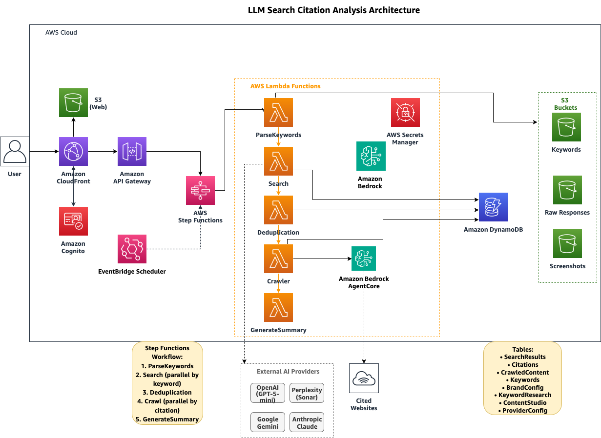
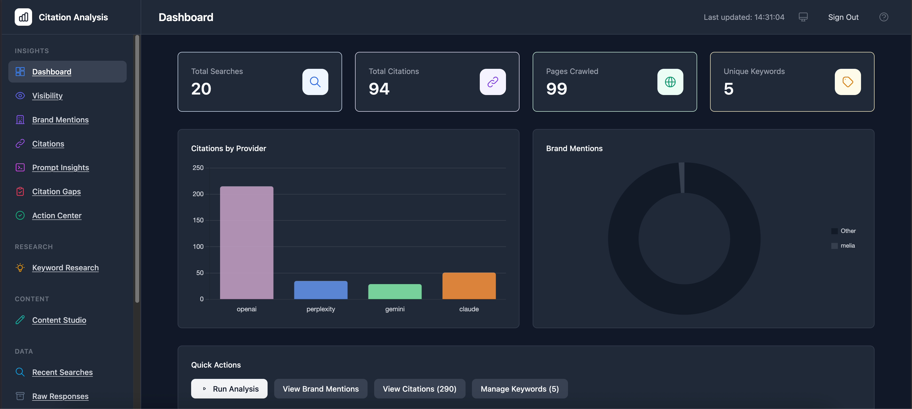
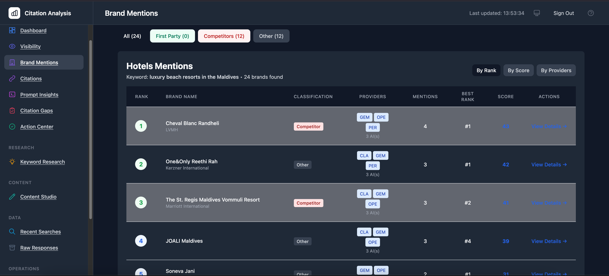
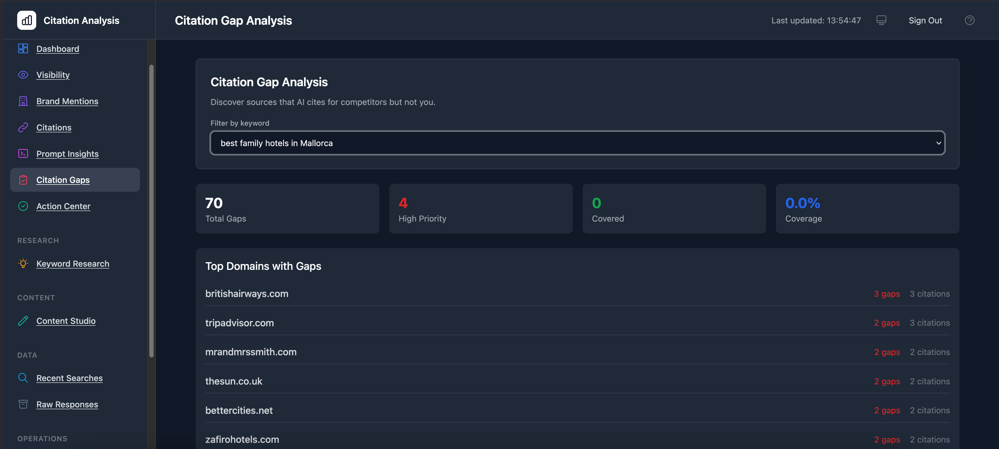
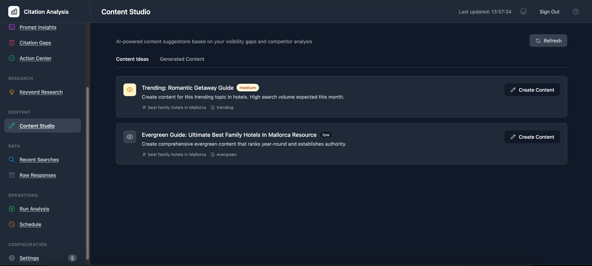

# Citation Analysis System

> **Important:** This is sample code for demonstration and educational purposes. It is not intended for production use without additional security review and testing. You should work with your security and compliance teams to meet your organizational requirements before deploying to production environments.

A serverless citation analysis system that queries multiple AI models with web search capabilities, captures their responses and citations, crawls cited pages using Amazon Bedrock AgentCore, and stores comprehensive results in DynamoDB for analysis.

## Architecture

The system uses AWS Step Functions to orchestrate the workflow and is deployed using AWS CDK in TypeScript.



### Components

- **Search Lambda**: Queries OpenAI, Perplexity, Gemini, and Claude with keywords
- **Deduplication Lambda**: Normalizes URLs and deduplicates citations across providers
- **Crawler Lambda**: Crawls cited pages using Bedrock AgentCore browser tools
- **Step Functions**: Orchestrates the workflow
- **DynamoDB**: Stores search results, citations, and crawled content
- **Secrets Manager**: Securely stores API keys

## Project Structure

```
citation-analysis-system/
├── bin/                        # CDK app entry point
├── lib/                        # CDK stack and constructs
│   ├── citation-analysis-stack.ts
│   └── constructs/auth.ts      # Cognito auth construct
├── lambda/
│   ├── api/                    # API endpoint handlers (20+ endpoints)
│   ├── search/                 # AI provider search + brand extraction
│   ├── deduplication/          # Citation deduplication
│   ├── crawler/                # Web crawling with AgentCore
│   ├── generate-summary/       # Execution summary generation
│   ├── parse-keywords/         # Keyword file parsing
│   ├── layer/                  # Shared Lambda layer
│   └── shared/                 # Common utilities and decorators
├── web/                        # React frontend (Vite + Tailwind)
│   └── src/
│       ├── components/         # UI components by feature
│       ├── hooks/              # Custom React hooks
│       └── types/              # TypeScript types
├── scripts/                    # Deployment and build scripts
└── cdk.json
```

## Prerequisites

- Node.js 20+ and npm
- Python 3.12
- AWS CLI configured with appropriate permissions
- AWS CDK CLI (`npm install -g aws-cdk`)
- At least one API key from: OpenAI (recommended), Perplexity, Google Gemini, or Anthropic Claude
- Docker recommended for building Lambda layers (falls back to cross-compilation if unavailable)

## Setup

### Quick Start (Automated Deployment)

Use the automated deployment script for a streamlined setup:

```bash
./scripts/deploy.sh
```

This script will:
- Check all prerequisites (Node.js, Python, AWS CLI, CDK)
- Install Node.js and Python dependencies
- Build the Lambda Layer
- Compile TypeScript
- Check/bootstrap CDK if needed
- Deploy the CDK stack
- Verify the deployment
- Display next steps

### Manual Setup (Advanced)

> **⚠️ Important**: Manual setup requires a two-pass deployment. The web dashboard needs configuration values (API Gateway URL, Cognito IDs) that only exist after the first deployment. If you skip steps or run them out of order, you'll encounter CORS errors. For most use cases, `npm run deploy` handles this automatically.

<details>
<summary>Expand manual setup instructions</summary>

#### 1. Install Dependencies

```bash
# Install CDK dependencies
npm install

# Install Python dependencies for each Lambda
cd lambda/search && pip install -r requirements.txt -t .
cd ../deduplication && pip install -r requirements.txt -t .
cd ../crawler && pip install -r requirements.txt -t .
```

#### 2. Bootstrap CDK (First Time Only)

```bash
cdk bootstrap
```

#### 3. First Deploy (creates the stack)

```bash
cdk deploy
```

#### 4. Build the Web Dashboard

```bash
./scripts/build-web.sh
```

This fetches the API Gateway URL and Cognito configuration from CloudFormation and builds the React dashboard with the correct config.

#### 5. Second Deploy (uploads the configured dashboard)

```bash
cdk deploy
```

The first deploy creates the infrastructure so the build script can fetch the configuration. The second deploy uploads the correctly configured dashboard to S3.

</details>

### Configure Your First Analysis

After deployment:

1. Open the dashboard URL (shown in CDK outputs)
2. Log in with your credentials (admin creates accounts via CLI — see User Registration below)
3. Go to **Settings > Providers** to enter your API keys for each AI provider you want to use
4. Go to **Settings > Brand Tracking** to configure brand detection:
   - Select an industry preset (hotels, airlines, retail, etc.) or choose Custom
   - Add your brand names under **First Party Brands** - these are tracked as "yours"
   - Add competitor brands under **Competitors** - these are tracked for comparison
   - The visibility dashboard calculates your share of voice based on this configuration
5. Go to **Keywords** to add search queries you want to analyze (e.g., "best hotels in Barcelona")
6. Click **Run Analysis** to start your first analysis run

## Visualization Dashboard

After deployment, access the real-time visualization dashboard at the CloudFront URL provided in the CDK outputs:

```bash
# Get the dashboard URL from CDK outputs
aws cloudformation describe-stacks \
  --stack-name CitationAnalysisStack \
  --query 'Stacks[0].Outputs[?OutputKey==`DashboardUrl`].OutputValue' \
  --output text
```

### Dashboard Features


*Dashboard overview with real-time statistics, provider comparison, and brand mentions*

- **Real-time Statistics**: Auto-refreshes every 30 seconds
- **Provider Comparison**: Bar chart showing citation counts by AI provider
- **Brand Analysis**: Pie chart of brand mentions across AI providers
- **Top Citations**: Table of most frequently cited URLs
- **Recent Searches**: Latest search results with timestamps
- **Filtering**: Filter by keyword or provider


*Brand mention tracking with sentiment analysis and ranking context*


*Citation gap analysis showing sources that cite competitors but not you*


*Content Studio generating optimised content based on citation gaps*

The dashboard is a static React application hosted on S3 and served via CloudFront, with data fetched from API Gateway endpoints backed by Lambda functions.

## Usage Guide

### Step 1: Configure AI Providers

Go to **Settings > AI Providers**. The system supports four providers:

| Provider | Model | Description |
|----------|-------|-------------|
| OpenAI | GPT-5 mini | Native web search via Responses API |
| Perplexity | Sonar | Real-time web search |
| Google Gemini | Flash 2.0 | Google Search grounding |
| Anthropic Claude | Sonnet 4.5 | Web search tool |

You need at least one provider configured with a valid API key. OpenAI is recommended as the primary provider. The system skips providers with placeholder or invalid keys and falls through to the next available one.

> **Paid API keys are required.** This tool analyses the AI providers you want to track, which means it calls their APIs at scale. Free tiers are designed for single API calls and will hit rate limits immediately under any real analysis workload. A small amount of paid credit per provider ($5-10) is more than enough for regular use.

For each provider you want to use:
1. Click **Add Key** and enter your API key
2. Toggle the switch to enable the provider
3. Only enabled providers with configured keys will be used during analysis

API keys are stored securely in AWS Secrets Manager.

### Step 2: Configure Brand Tracking

Go to **Settings > Brand Tracking**. This is essential for visibility scoring.

1. **Select an industry preset** (hotels, airlines, retail, technology, etc.) or choose Custom
2. **Add First Party Brands** – Your brands. These are tracked as "yours" in visibility calculations.
3. **Add Competitor Brands** – Brands you want to compare against.
4. Optionally use **Expand Brands** to discover related brands via AI, or **Find Competitors** to discover competitors automatically.

Without brand tracking configured, the Visibility dashboard will show 0.0 scores even if data exists.

### Step 3: Add Keywords

Go to **Settings > Keywords**. Add search queries that represent how customers search for your products:

- Use natural language queries: "best hotels in Barcelona", "enterprise project management software"
- Add multiple keywords to track different aspects of your market
- Keywords are used when running analysis

### Step 4: Configure Query Prompts (Personas)

Go to **Settings > Query Prompts**. Define persona-based search templates that shape how AI engines are queried:

- Each prompt contains a `{keyword}` placeholder that gets substituted during analysis
- Example: "As a parent travelling with 3 young kids, {keyword}. What are the best family-friendly options?"
- Create multiple personas to see how different traveler types get different AI recommendations
- Enable/disable individual prompts to control which run during analysis
- Each analysis run executes all enabled prompts × all keywords × all providers
- After analysis, use the persona filter on the Visibility and Brand Mentions pages to compare how your brand ranks under each persona

### Step 5: Run Analysis

Go to **Operations > Run Analysis**:

1. Select which keywords to analyze (or all)
2. Click **Start Analysis**
3. Monitor progress in the execution view
4. Analysis typically takes 3-5 minutes depending on keyword count

For recurring analysis, go to **Operations > Schedule** to set up automated runs with EventBridge.

### Step 6: Explore Results

After analysis completes, explore your data:

**Insights Section:**
- **Dashboard** – Overview stats: total searches, citations, pages crawled
- **Visibility** – Your visibility score vs competitors, with 30-day trends. Shows share of voice by provider. Filter by persona to see how rankings change for different audience segments. The persona comparison chart plots your brand's average rank across personas side by side with competitors.
- **Brand Mentions** – Every mention of your brand and competitors with sentiment (positive/negative/neutral) and ranking context. Filter by persona to see which brands appear under each audience segment.
- **Citations** – All URLs cited by AI models, ranked by frequency. Click any URL to see breakdown by keyword and provider.
- **Prompt Insights** – How AI models frame their responses to your keywords
- **Citation Gaps** – Sources that cite competitors but not you. This is your PR/content target list.
- **Action Center** – Prioritized recommendations based on your data

**Research Section:**
- **Keyword Research** – Expand your keyword list using AI with live web search. Analyze competitor websites to discover keywords they target. Both operations run asynchronously — results appear after 30-60 seconds.

**Content Section:**
- **Content Studio** – Generate content briefs and outlines based on citation gap analysis, with output language selection (English, Spanish, French, or any language). Helps you create content that AI models are more likely to cite. Self-reflection recommendations from the ranking analysis also appear here as actionable content ideas, labelled with the originating persona.
- **Ranking Analysis (Self-Reflection)** – For any brand and persona combination, ask the AI to explain why it ranked the brand where it did. Returns a structured breakdown: what the brand's content contributed, what competitors showed, what data points were missing, and prioritised content recommendations to improve ranking. Results are cached for 24 hours. This is industry-agnostic and works with whatever industry you have configured.

**Data Section:**
- **Recent Searches** – Your analysis history with full AI responses
- **Raw Responses** – Browse raw JSON responses and screenshots stored in S3

## Technical Details

### AI Model Configuration

The default OpenAI model is `gpt-5-mini` (cost-effective, supports web search). To use a different model:

1. Go to **Settings > AI Providers**
2. The model can be overridden per provider via the ProviderConfig DynamoDB table
3. Set the `model` field for any provider to change the default (e.g., `gpt-5.2` for higher quality)

Content generation (Content Studio) and ranking self-reflection both use Amazon Bedrock Claude Haiku 4.5. This runs on your AWS account and does not require an external API key. Self-reflection results are cached in a dedicated DynamoDB table with a 24-hour TTL to avoid repeated LLM calls for the same keyword, brand, and persona combination.

### Retry Logic
- All API clients implement exponential backoff (5 retries, ~35s max wait)
- Handles rate limits (429), server errors (5xx), timeouts, and connection errors
- Step Functions retry on Lambda-level failures only

### Concurrency
- Keyword processing: 3 concurrent
- Citation crawling: 3 concurrent per keyword

### Security

#### User Registration

By default, self-registration is **disabled** — only administrators can create user accounts via the Cognito console or AWS CLI. This is the recommended setting for production deployments.

To allow users to sign up themselves, change `selfSignUpEnabled` in `lib/constructs/auth.ts`:

```typescript
const userPool = new UserPool(this, "userPool", {
  selfSignUpEnabled: true,  // set to false for admin-only invites
  ...
});
```

Then redeploy with `cdk deploy`. When self-registration is disabled, invite users via:

```bash
aws cognito-idp admin-create-user \
  --user-pool-id <your-pool-id> \
  --username user@example.com \
  --user-attributes Name=email,Value=user@example.com \
  --desired-delivery-mediums EMAIL
```

#### Other Security Features

- API keys encrypted in AWS Secrets Manager
- DynamoDB encryption at rest
- IAM least-privilege roles
- CloudWatch audit trails

#### Federated Identity with Azure AD (Entra ID)

To allow users to sign in with their corporate Azure AD credentials instead of Cognito-managed passwords:

1. **Register an application in Azure AD**: Go to Azure Portal > App registrations > New registration. Set the redirect URI to `https://<your-cognito-domain>.auth.<region>.amazoncognito.com/oauth2/idpresponse`.

2. **Note the Azure AD details**: Application (client) ID, Directory (tenant) ID, and create a client secret under Certificates & secrets.

3. **Add Azure AD as a Cognito identity provider**: In the AWS Console, go to Cognito > User Pools > your pool > Sign-in experience > Add identity provider > OIDC. Configure:
   - Provider name: `AzureAD`
   - Client ID: your Azure application client ID
   - Client secret: your Azure client secret
   - Issuer URL: `https://login.microsoftonline.com/<tenant-id>/v2.0`
   - Scopes: `openid email profile`
   - Map attributes: `email` → `email`, `sub` → `username`

4. **Configure the Cognito hosted UI domain**: Under App integration > Domain, set up a Cognito domain or custom domain.

5. **Update the app client**: Under App integration > App clients, enable the AzureAD identity provider and configure the allowed OAuth flows (Authorization code grant) and scopes (openid, email, profile).

6. **Update the frontend**: In `lib/constructs/auth.ts`, add the identity provider to the user pool client's `supportedIdentityProviders` and update the OAuth callback URLs if needed.

For detailed steps, see the [AWS documentation on adding OIDC identity providers to Cognito](https://docs.aws.amazon.com/cognito/latest/developerguide/cognito-user-pools-oidc-idp.html).

## Cost

> **Pricing accuracy:** All figures below were verified against published pricing pages on 26th May 2026. Provider pricing changes regularly. Treat these numbers as a directional guide and verify against the linked sources before committing to a workload size. The figures use US East (N. Virginia) rates.

Operating cost has two components: AWS infrastructure and external AI provider APIs. For most workloads the AI provider APIs dominate. The system does not perform request batching or prompt caching by default, so cost scales linearly with `keywords × providers × personas × runs`.

### AWS infrastructure

For a representative workload of 100 keywords analysed weekly across 4 LLM providers and 3 personas (about 6,200 search invocations per month), AWS infrastructure costs are typically $30 to $60 per month. The actual bill depends heavily on how many citations get crawled, since the crawler uses Bedrock AgentCore browser sessions which carry a non-trivial per-session cost.

| Service | Monthly cost | Notes |
|---------|--------------|-------|
| [Lambda](https://aws.amazon.com/lambda/pricing/) | $1-3 | Mostly within the 1M request and 400,000 GB-s free tier |
| [DynamoDB on-demand](https://aws.amazon.com/dynamodb/pricing/on-demand/) | $2-10 | $0.625 per million writes, $0.125 per million reads, $0.25/GB storage above the 25 GB free tier, across 11 tables |
| [API Gateway REST](https://aws.amazon.com/api-gateway/pricing/) | $1-5 | $3.50 per million calls (the dashboard polls every 30 seconds) |
| [Step Functions](https://aws.amazon.com/step-functions/pricing/) | <$1 | $0.000025 per state transition, 4,000 free per month |
| [S3](https://aws.amazon.com/s3/pricing/) | $1-5 | Raw responses, screenshots, access logs (lifecycle expires the latter two at 90 days) |
| [Secrets Manager](https://aws.amazon.com/secrets-manager/pricing/) | $4 | Roughly 9 stored API key secrets at $0.40 each, plus negligible API call charges |
| [Cognito Essentials](https://aws.amazon.com/cognito/pricing/) | $0 | First 10,000 monthly active users are free |
| [WAF](https://aws.amazon.com/waf/pricing/) | $10-15 | $5 per web ACL plus $1 per rule plus $0.60 per million requests; the stack provisions one web ACL with several rules |
| [CloudFront](https://aws.amazon.com/cloudfront/pricing/) | $0-2 | Pay-as-you-go, dashboard traffic is small |
| [Bedrock AgentCore Browser](https://aws.amazon.com/bedrock/agentcore/pricing/) | $5-20 | Crawler sessions for cited URLs; this can be the largest single line item if your keywords return many distinct URLs |

### AI provider API costs

These are billed by each provider directly, not on your AWS bill, except for Amazon Bedrock which appears under the Bedrock line on the AWS bill. Rates verified 26th May 2026 against official pricing pages and current model specifications:

| Provider | Default model | Input | Output |
|----------|--------------|-------|--------|
| [OpenAI](https://openai.com/api/pricing/) | `gpt-5-mini` | $0.25 / 1M tokens | $2.00 / 1M tokens |
| [Anthropic Claude](https://www.anthropic.com/pricing) | `claude-sonnet-4-5` | $3.00 / 1M tokens | $15.00 / 1M tokens |
| [Google Gemini](https://ai.google.dev/gemini-api/docs/pricing) | `gemini-3-flash-preview` | $0.50 / 1M tokens | $3.00 / 1M tokens |
| [Perplexity](https://docs.perplexity.ai/docs/getting-started/pricing) | `sonar` | $1.00 / 1M tokens | $1.00 / 1M tokens |

The system also uses Amazon Bedrock Claude Haiku 4.5 internally for brand extraction (every analysis run) and for Content Studio and ranking self-reflection (on demand). Bedrock pricing for Haiku 4.5 is $1/M input and $5/M output tokens. Self-reflection results cache for 24 hours per `(keyword, brand, persona)` tuple so repeat queries don't re-bill.

### Worked example

Workload: 100 keywords, 4 LLM providers, 3 personas, 4 runs per month (weekly). That's `100 × 4 × 3 × 4 = 4,800` provider calls per month. Each call sends roughly 100 input tokens (the persona-templated keyword) and receives roughly 1,500 output tokens. The Claude client is capped at 1,024 output tokens; OpenAI, Gemini, and Perplexity have no explicit cap in this codebase but typically return similar lengths.

Per-month token totals: 480k input tokens and 7.2M output tokens, distributed roughly equally across the 4 providers (120k input and 1.8M output per provider).

| Provider | Monthly tokens | Cost |
|----------|---------------|------|
| OpenAI gpt-5-mini | 120k in, 1.8M out | $0.03 + $3.60 = **$3.63** |
| Anthropic Sonnet 4.5 | 120k in, 1.8M out | $0.36 + $27.00 = **$27.36** |
| Gemini 3 Flash Preview | 120k in, 1.8M out | $0.06 + $5.40 = **$5.46** |
| Perplexity Sonar | 120k in, 1.8M out | $0.12 + $1.80 = **$1.92** |
| **Subtotal (provider APIs)** | | **~$38** |

Plus Amazon Bedrock Claude Haiku 4.5 for brand extraction across all responses: roughly 7.2M tokens in (the responses being analysed) and 200k tokens out (the structured brand list). That's `7.2 × $1 + 0.2 × $5 = $8.20` on the Bedrock line.

**Total AI charges in this scenario: approximately $46 per month**, of which Anthropic Sonnet alone accounts for about $27. Replacing Sonnet with Haiku 4.5 across the board cuts the total to about $28 per month. Disabling Anthropic entirely cuts it to about $19. Running Gemini-only reduces it further still.

### Reducing cost

- **Pick cheaper models.** Sonnet costs 15× more on output than Haiku. Gemini Flash is cheaper still. Configure per-provider model overrides in the ProviderConfig DynamoDB table.
- **Disable providers and personas you don't need.** Each combination multiplies the bill. The system queries every enabled provider for every persona for every keyword.
- **Run weekly, not daily.** A daily schedule is 7× more expensive than weekly with no proportional gain in insight quality.
- **Cap the crawler.** AgentCore browser sessions can be the biggest AWS line item. The crawler currently runs concurrency 3 per keyword; reduce this in the Step Functions state machine if costs run high.
- **Set DynamoDB TTLs.** Tables like `SearchResults` and `CrawledContent` retain everything by default. Add a TTL attribute if you don't need full history.
- **Track spend.** Use [AWS Cost Explorer](https://aws.amazon.com/aws-cost-management/aws-cost-explorer/) and filter by `aws:cloudformation:stack-name = CitationAnalysisStack` (you may need to activate the cost allocation tag first).

## Development

```bash
npm run build          # Build TypeScript
npm run watch          # Watch mode
npm run synth          # Synthesize CloudFormation
npm run deploy         # Full deployment (recommended)
npm run deploy:full    # Deploy + clear CloudFront cache
npm run clear-cache    # Clear CloudFront cache only
```

## License

This library is licensed under the MIT-0 License. See the [LICENSE](LICENSE) file.
