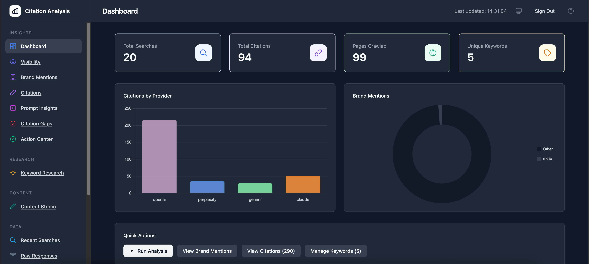
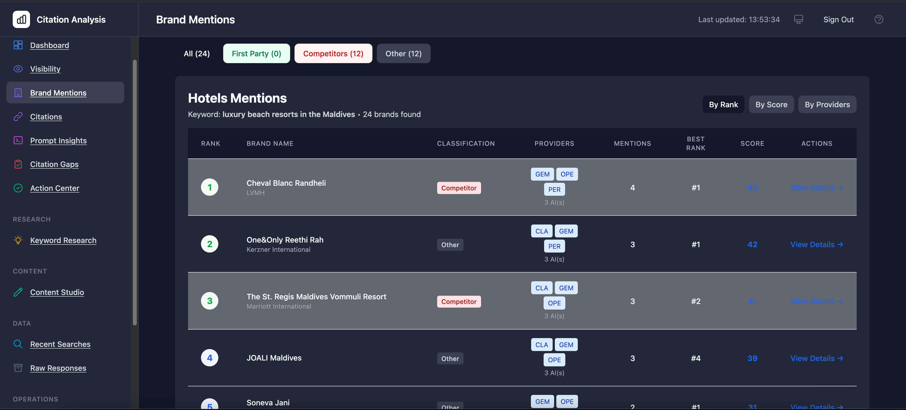
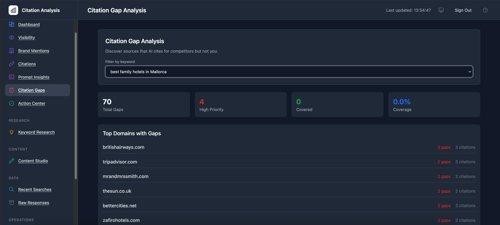
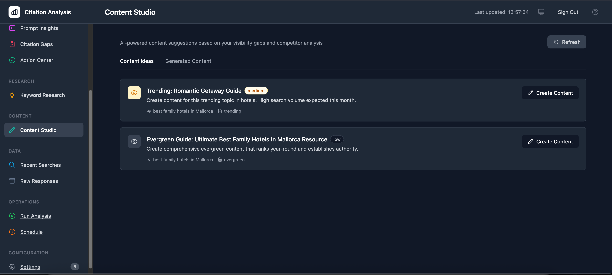
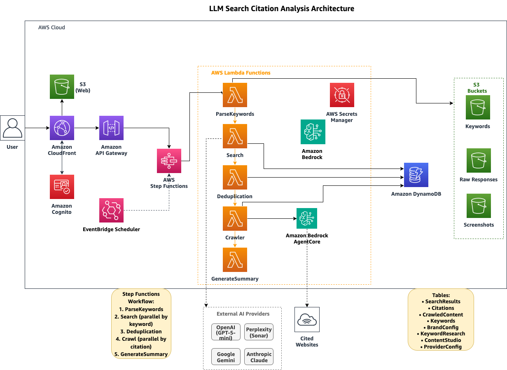

# Citation Analysis System

> **Important:** This is sample code for demonstration and educational purposes. It is not intended for production use without additional security review and testing. You should work with your security and compliance teams to meet your organizational requirements before deploying to production environments.

A serverless system that tracks how AI engines (OpenAI, Perplexity, Gemini, Claude) mention and cite brands. It sends your keywords to each engine with web search enabled, stores every answer and its citations, extracts the brands named, crawls the cited pages with Amazon Bedrock AgentCore, and reports visibility KPIs, competitor benchmarks and content gaps in a React dashboard. It is deployed with AWS CDK (TypeScript); the backend is Python 3.12 Lambda functions orchestrated by AWS Step Functions.

## Features

The dashboard sidebar has these sections:

| Section | Pages |
|---|---|
| Insights | **Dashboard** (totals, citations by provider, brand mentions, KPI alerts), **Visibility** (the KPIs for one keyword, a keyword group or all keywords, with 7/30/90-day KPI history, brand leaderboard, per-engine KPIs and cited domains; persona filter), **Brand Mentions** (every brand named, with sentiment, rank and a per-brand ranking analysis), **Citations** (cited URLs by frequency, with a per-keyword and per-provider breakdown), **Prompt Insights** (which queries and personas rank you in the top 3), **Citation Gaps** (sources that cite competitors but not you), **Action Center** (prioritised recommendations with a status you can track) |
| Research | **Keyword Research**: Expand, Competitor (analyse a competitor website), Agent (a Bedrock research agent that plans web-search queries over up to three rounds, with saved prompt templates) and History |
| Content | **Content Studio**: content ideas and briefs from citation gaps and ranking analyses, single or per keyword group, in any output language, exportable as DOCX |
| Reporting | **Reports**: nine print-ready reports (below), plus custom reports you build from their sections |
| Data | **Recent Searches** (analysis history with full answers), **Raw Responses** (raw JSON answers and crawl screenshots from S3) |
| Operations | **Run Analysis**, **Schedule** (EventBridge Scheduler runs) |
| Configuration | **Settings**: Keywords (with keyword groups), Brand Tracking, Personas, AI Providers, Alerts, Users (admins only) |

Most views export to Excel, the header's PDF button prints the current view (print mode, `?print=1`), and the UI has light, dark and system themes. A first-run guide walks through setup, and a banner flags a provider that is failing.









### Reports

Listed on **Reporting > Reports** (`web/src/components/Reports/ReportsLandingView.tsx`), routed by `ReportsRouter.tsx`:

| Report | Route | For |
|---|---|---|
| Executive Summary | `/reports/executive-summary` | CMO, VP Marketing |
| Brand Visibility Report | `/reports/visibility` (`/reports/visibility/:keyword`) | Marketing lead |
| Competitor Benchmark | `/reports/benchmark` | Brand manager, competitive intelligence |
| AI Engines | `/reports/engines` | AI search specialist |
| Sources | `/reports/sources` | SEO and digital PR |
| Sentiment | `/reports/sentiment` | Brand / communications lead |
| Competitor Gap Report | `/reports/competitor` (`/reports/competitor/:competitor`) | Content / PR strategist |
| Content Action Plan | `/reports/content-action-plan` | Content strategist |
| Keyword Deep Dive | `/reports/keyword` (`/reports/keyword/:keyword`) | SEO / AI search lead |

**Custom reports** (`/reports/custom/new`, `/reports/custom/:id`, `/reports/custom/:id/edit`; `web/src/components/Reports/customReport/`): any signed-in user can name a report, pick blocks from a list sorted into categories (one per report above, plus their own headings, Markdown text, https images and YouTube or Vimeo videos), drag or add them into one ordered list and save it. Every user sees every saved report (at most 50). A saved report opens on every keyword and its saved period (30, 90 or 180 days); the reader can narrow it to a keyword group or one keyword and change the period in the URL, like the scope reports. Each data source is fetched once however many blocks read it. A block that needs a particular scope (a single keyword for the Keyword Deep Dive blocks, a keyword group for the group KPI blocks) says so instead of showing the wrong data. The catalogue and the stored block types live in `customReport/blockCatalog.ts`.

### KPIs

The Visibility tab, the per-group report, the Executive Summary, Brand Visibility, Competitor Benchmark, AI Engines, Sources, Sentiment and Keyword Deep Dive reports, their exports and the KPI alerts use one set of KPIs, counted per AI-engine answer and pooled across a scope: answers, mentions, mention rate, share of voice, average position, top-1 and top-3 share, visibility score (position-weighted, 0–100), citations, citation rate, citation share, net sentiment, engine coverage and keyword coverage. Definitions, formulas and edge cases are in [docs/kpi-definitions.md](docs/kpi-definitions.md). The Dashboard, Brand Mentions, Personas, Prompt Insights, Citation Gaps, Action Center and the Competitor Gap and Content Action Plan reports still compute their own figures.

## Architecture



### Workflows (Step Functions)

- **`CitationAnalysis-Workflow`** (one execution per analysis run, 7-day timeout): ParseKeywords (writes the run's keyword list to `runs/<execution>/keywords.json` in the keywords bucket) → ProcessKeywords Distributed Map (one child execution per keyword: SearchAllProviders, a Parallel state calling every provider at once through its own `CitationAnalysis-Search-<provider>` Lambda → MergeProviderResults → DeduplicateCitations → CrawlCitations Map → SummarizeKeywordResult; results written to S3) → GenerateSummary (reads the results from S3, stores the full report under `execution-summaries/`) → KpiAlerts. The run's state and history stay the same size however many keywords it covers, and there is no per-run keyword cap. Keywords run 20 at a time by default (`-c processKeywordsConcurrency=N`) and citations are crawled 10 at a time per keyword (`-c crawlConcurrency=N`). Each provider has a cap on calls in flight across the whole run (`-c providerConcurrency`); a keyword whose provider is at its cap waits for a free slot, and every client waits out rate limits (`Retry-After`, `x-ratelimit-reset`) instead of failing, so no provider call is lost to throttling. SerpAPI searches are submitted asynchronously and read back from its Search Archive, so a slow search is waited for rather than re-sent. A failed crawl or alert evaluation does not fail the run; up to 10% of keywords may fail (reported as `completed_with_errors`) before the run stops. `runs/` objects expire after 30 days.
- **`CitationAnalysis-KeywordResearch`** (one execution per research job, 30-minute timeout): PlanResearch → ExecuteResearchSteps Map (up to 10 steps in parallel) → EvaluateResearch → continue? → PlanResearch … | FinalizeResearch. Each step checkpoints its result into the job row, so a failed provider keeps the other results and can be retried on its own.

### Lambda functions

All functions run Python 3.12.

| Function | Code | Role |
|---|---|---|
| ParseKeywords, Search, Deduplication, Crawler, GenerateSummary, KpiAlerts | `lambda/parse-keywords`, `search`, `deduplication`, `crawler`, `generate-summary`, `kpi-alerts` | Analysis workflow steps |
| ResearchWorker | `lambda/research-worker` | Keyword research steps |
| API-StatsInsights, API-CitationsContent, API-KeywordMgmt, API-ConfigMgmt, API-ExecutionMgmt, API-GetBrandMentions, API-ManageBrandConfig, API-GetPersonaRankings, API-SelfReflection, API-ContentStudio, API-ManageUsers, API-Health | `lambda/api/*.py` | REST API handlers; the consolidated functions bundle several handler files each |
| ContentStudioWorker | `lambda/api/content-studio.py` | Content generation, fed by a DynamoDB stream and a 5-minute reconcile rule |

Two layers: the **shared layer** (`lambda/layer/`: `lambda/shared` modules plus `requests`, `bs4` and `tzdata`) used by every function except the crawler, and the **crawler layer** (`lambda/crawler-layer/`: Playwright, Bedrock AgentCore and a copy of the shared modules). Synth fails if either layer is not built or its copy of `lambda/shared` is stale. The crawler uses a pre-created AgentCore browser with Web Bot Auth and reuses a crawl for 30 days.

### Data

All tables are DynamoDB on-demand with AWS-managed encryption, point-in-time recovery and `RETAIN`:

| Table (`CitationAnalysis-…`) | Key | Holds |
|---|---|---|
| SearchResults | keyword / timestamp_provider | Every provider answer, with extracted brands |
| Citations | keyword / normalized_url | Deduplicated citations |
| CrawledContent | normalized_url / crawled_at | Crawled page content, summaries and SEO data |
| Keywords | id | Keywords; `group_ids` holds group membership |
| KeywordGroups | id | Keyword groups |
| KeywordResearch | id | Research jobs and their steps (TTL) |
| ResearchTemplates | id | Saved research agent prompts |
| BrandConfig | config_id | Industry, first-party and competitor brands, owned domains |
| ProviderConfig | provider_id | Provider enablement, model override, health |
| QueryPrompts | id | Personas |
| ContentStudio, ContentBriefBatches, ContentBriefTemplates | id / batch_id / id | Generated content, batch manifests, saved prompt templates |
| CustomReports | id | Saved custom reports (title, ordered blocks, period; at most 50) |
| SelfReflection | keyword_brand / persona_timestamp | Ranking analysis cache (24 h TTL) |
| RecommendationStatus | recommendation_id | Action Center item status (TTL) |
| KpiSnapshots, KpiAlerts, AlertSettings, ContentChanges | group_id / snapshot_at, id, config_id, group_id / changed_at | KPI alert baselines, alerts, thresholds, content-change markers |

S3 buckets (`citation-analysis-<name>-<account>`): `keywords` (keyword files and run summaries), `raw-responses`, `screenshots` (moved to Infrequent Access after 90 days), `web` (the dashboard) and `access-logs` (expire after 90 days). KPI alert emails go through the SNS topic `CitationAnalysis-KpiAlerts`.

### API and hosting

A REST API (`CitationAnalysis-API`, stage `prod`, all routes under `/api`) with Lambda proxy integrations and a Cognito user pool authorizer on every route except `GET /api/health`. Saved custom reports are `GET`/`POST /api/custom-reports` and `PUT`/`DELETE /api/custom-reports/{id}` on API-ConfigMgmt, open to any signed-in user. The dashboard is a static Vite build in a private S3 bucket served by CloudFront through origin access control; its content security policy allows embedded players from `www.youtube-nocookie.com` and `player.vimeo.com` only (custom report video blocks).

## Project structure

```
├── bin/                     # CDK app entry point (stack CitationAnalysisStack)
├── lib/
│   ├── citation-analysis-stack.ts
│   └── constructs/          # auth.ts (Cognito), bedrock-model-access.ts
├── lambda/
│   ├── api/                 # API handlers
│   ├── search/              # Provider queries, brand extraction, web-search providers
│   ├── deduplication/  crawler/  parse-keywords/  generate-summary/  kpi-alerts/
│   ├── research-worker/     # Keyword research state machine steps
│   ├── shared/              # Shared modules (KPI engine, clients, decorators, config)
│   ├── layer/  crawler-layer/   # Layer build scripts and requirements
│   ├── testing/             # Test support: module loader, DynamoDB stubs, events, env
│   ├── conftest.py
│   └── requirements-dev.txt # Python dev toolchain
├── web/src/
│   ├── api/  components/  constants/  exporters/  formatting/
│   ├── hooks/  infrastructure/  types/
│   └── test/                # Test support
├── docs/                    # kpi-definitions.md, design-system.md, screenshots
├── scripts/                 # Deploy, build and quality-gate scripts
└── cdk.json
```

## Prerequisites

- Node.js 20+ and npm
- Python 3.12 and pip
- AWS CLI with credentials and a default region (`aws configure`, or `AWS_REGION`)
- AWS CDK CLI (`npm install -g aws-cdk`)
- An API key for at least one of OpenAI, Perplexity, Google Gemini or Anthropic. Paid keys are needed: free tiers hit rate limits at analysis volume; $5–10 of credit per provider covers regular use.
- Docker (optional): the layer builds use the Lambda Python image when Docker is running and fall back to cross-platform pip wheels otherwise.

## Deployment

```bash
npm run deploy      # same as ./scripts/deploy.sh
```

`scripts/deploy.sh` checks the tools and AWS credentials, runs `npm install`, builds both Lambda layers and the dashboard, compiles the CDK app, offers to run `cdk bootstrap` if the account/region is not bootstrapped, deploys the stack, rebuilds the dashboard with the new API and Cognito outputs, syncs it to the web bucket, invalidates CloudFront, verifies the core resources and prints the dashboard URL.

<details>
<summary>Manual deployment</summary>

The dashboard needs the API URL and Cognito IDs, which exist only after the first deploy, so the frontend is built twice:

```bash
npm install
bash lambda/layer/build-layer.sh           # rebuild after any change to lambda/shared
bash lambda/crawler-layer/build-layer.sh
(cd web && npm install && npm run build)   # synth requires web/dist
npm run build
cdk bootstrap                              # first time per account/region
cdk deploy
./scripts/deploy-web.sh                    # rebuild with the stack outputs, upload, invalidate CloudFront
```

</details>

Other commands:

| Command | Does |
|---|---|
| `npm run deploy:cdk` | `cdk deploy --require-approval never` (layers and `web/dist` must already be built) |
| `npm run deploy:full` | `deploy:cdk`, then clear the CloudFront cache |
| `./scripts/deploy-web.sh` | Frontend only: build, sync to S3, invalidate CloudFront |
| `./scripts/build-web.sh` | Build the dashboard with `VITE_*` values from the stack outputs |
| `npm run clear-cache` | Invalidate the CloudFront distribution |
| `npm run synth` | `cdk synth` |
| `./scripts/quick-error-check.sh [minutes]` | Count provider retries and errors in the Search Lambda logs |
| `python3 scripts/delete-orphaned-log-groups.py [--delete]` | List (or delete) `/aws/lambda/*` log groups whose function no longer exists |

Get the dashboard URL later with:

```bash
aws cloudformation describe-stacks --stack-name CitationAnalysisStack \
  --query 'Stacks[0].Outputs[?OutputKey==`DashboardUrl`].OutputValue' --output text
```

## Getting started

1. **Create the first user.** Self sign-up is off. Create an administrator with the CLI and add it to the `Admin` group; admins can then invite users from **Settings > Users**.

   ```bash
   aws cognito-idp admin-create-user --user-pool-id <UserPoolId> \
     --username user@example.com \
     --user-attributes Name=email,Value=user@example.com Name=email_verified,Value=true \
     --desired-delivery-mediums EMAIL
   aws cognito-idp admin-add-user-to-group --user-pool-id <UserPoolId> \
     --username user@example.com --group-name Admin
   ```

2. **Settings > AI Providers.** Use **Add Key** and enable each provider you want. Keys are stored in Secrets Manager as `citation-analysis/<provider>-key`. Only enabled providers with a key are queried; a provider that fails three times in a row with an invalid key or no credit is disabled automatically and flagged in the dashboard banner.

   | Provider | Default model | Web search |
   |---|---|---|
   | OpenAI | `gpt-5-mini` | Responses API `web_search_preview` tool |
   | Perplexity | `sonar` (or `sonar-pro`, `sonar-reasoning-pro`) | Built in |
   | Google Gemini | `gemini-3-flash-preview` | Google Search grounding |
   | Anthropic Claude | `claude-sonnet-4-5` | `web_search` tool, 1,024 output tokens |

   **Change model** on each card picks another model: OpenAI, Gemini and Claude list the models your key can use, Perplexity offers its Sonar models, and you can type any id. Before a model is saved it must answer a real web-search request with your key, so a model that cannot search is refused instead of failing the next run.

   The same page lists optional web-search providers (Brave, Tavily, Exa, SerpAPI, Firecrawl). They add cited links to a run but write no answer, so they do not count towards the KPIs. A SerpAPI key also enables the research agent's Google signals step.

3. **Settings > Brand Tracking.** Pick an industry preset or Custom, add your **First Party Brands** and competitors (**Expand Brand** and **Find Competitors** suggest more with Bedrock), and add your **Owned Domains**. Without first-party brands nothing counts as your mention; without owned domains the citation KPIs stay empty.

4. **Settings > Keywords.** Add the queries your customers ask (for example "best hotels in Barcelona"). Keyword groups work like folders, one per property or product line; a keyword can be in several groups. Tick keywords and use **Add to group**, or filter the list by group. Deleting a group keeps its keywords.

5. **Settings > Personas** (optional). Each persona is a prompt template with a `{keyword}` placeholder, for example "As a parent travelling with 3 young kids, what are the best options for {keyword}?". A run sends every enabled persona × keyword × provider. Filter the Visibility and Brand Mentions pages by persona to compare.

6. **Operations > Run Analysis.** Pick a keyword group, tick keywords, or leave everything unticked to run all active keywords, then **Start Analysis**.

7. **Operations > Schedule.** Named daily, weekly or monthly schedules in any IANA timezone, scoped to all keywords, keyword groups (resolved when the schedule fires) or a fixed selection, with **Run now**.

8. **Settings > Alerts** (optional). After every run the KpiAlerts step compares each keyword group's KPIs with its previous complete run and raises alerts for a mention-rate drop, a loss of average position, a competitor entering the top positions, a keyword that stops naming you, and a visibility gain after a content change you recorded. Alerts appear on the Dashboard and can be emailed.

## Configuration

### Bedrock models

Internal model calls use Amazon Bedrock (global inference profiles) and need no external key. `lambda/shared/models.py` maps each task to a tier:

| Tier | Model | Used for |
|---|---|---|
| fast | Claude Haiku 4.5 | Brand extraction, crawler page summaries, Content Studio, research agent round evaluation |
| balanced | Claude Sonnet 4.6 (2,000-token thinking budget) | Ranking analysis (self-reflection), Action Center recommendations, brand expansion and competitor discovery, research agent planning |
| deep | Claude Opus 4.7 | Not used by default |

A function's tier can be changed with `BEDROCK_TIER_<ROLE>` or a model pinned with `BEDROCK_MODEL_<ROLE>` (roles: `SUMMARIZATION`, `EXTRACTION`, `GENERATION`, `ANALYSIS`, `RESEARCH_PLANNING`, `RESEARCH_EVALUATION`); the stack sets the tiers in `bedrockTierEnv` in `lib/citation-analysis-stack.ts`.

### Anthropic model access

Anthropic models on Bedrock need three things: `bedrock:InvokeModel` (granted per Lambda role), the one-time Anthropic use-case form (per account) and an AWS Marketplace subscription per model (per account). The `BedrockModelAccess` construct submits the form and subscribes Haiku 4.5, Sonnet 4.6 and Opus 4.7 at deploy time, so a new account needs no console steps; only its deploy-time function holds `aws-marketplace:Subscribe`. The `BedrockModelsEnabled` output lists the subscribed models.

- The account needs a verified payment method and a billing country Anthropic supports. A model that cannot be subscribed is reported as unavailable and the deploy continues. A refused form (already submitted, organization-level grant) is not an error.
- The form and subscriptions are account state and stay when the stack is deleted.
- Opus 4.7 is not offered on demand to every account; the default tiers do not use it.

If model access is managed elsewhere, skip all of this with `cdk deploy -c skipModelProvisioning=true` (`BedrockModelsEnabled` then reads `none (skipModelProvisioning)`); Bedrock calls fail with `AccessDeniedException` until access exists.

### CDK context

| Key | Default | Effect |
|---|---|---|
| `processKeywordsConcurrency` | `20` | Keywords processed in parallel per run |
| `crawlConcurrency` | `10` | Cited pages crawled in parallel per keyword |
| `providerConcurrency` | `{"openai":10,"perplexity":3,"gemini":10,"claude":5,"brave":10,"tavily":10,"exa":5,"serpapi":5,"firecrawl":2}` | Most calls each provider may have in flight across the whole run (reserved concurrency of its `CitationAnalysis-Search-<provider>` Lambda). Override any subset, e.g. `-c providerConcurrency='{"perplexity":5,"firecrawl":10}'`; `0` means no cap. The defaults suit free and entry-tier keys; raise them for paid plans. They reserve 60 Lambda concurrency, so an account with a low Lambda concurrency limit must lower them (AWS keeps at least 100 unreserved). |
| `skipModelProvisioning` | `false` | Skip the Anthropic form and Marketplace subscriptions |
| `anthropicCompanyName`, `anthropicCompanyWebsite`, `anthropicIndustry`, `anthropicUseCases` | `Citation Analysis`, `https://aws.amazon.com/bedrock/`, `Technology`, "Summarize content and generate new marketing content." | Details submitted on the Anthropic form |
| `dev` | off | `-c dev=true` lets `http://localhost:5173` call the API (`cd web && npm run dev`) |

### Secrets

The stack imports, and never creates, `citation-analysis/{openai,perplexity,gemini,claude,brave,tavily,exa,serpapi,firecrawl}-key`. **Settings > AI Providers** creates or updates a secret when you save a key; `aws secretsmanager create-secret --name citation-analysis/<provider>-key --secret-string <key>` works too.

## Security

- **Authentication:** Cognito user pool, email sign-in, self sign-up disabled, password policy of 8+ characters with all character classes, 1-hour access and ID tokens and 7-day refresh tokens. MFA is not configured. The API's Cognito authorizer covers every route except `GET /api/health`; user management requires the `Admin` group.
- **Edge:** CloudFront with HTTPS redirect and security headers (CSP, HSTS, frame DENY). There is no WAF, by design, so the sample stays pay-per-use: the API relies on the Cognito authorizer, a 100 rps / 200 burst stage throttle and a 10,000 requests/day usage plan. See [SECURITY.md](SECURITY.md#aws-waf) to add one.
- **CORS:** API error responses and each Lambda allow only the CloudFront origin (read from SSM `/citation-analysis/cors-origin`).
- **Data:** S3 buckets block public access and require TLS; DynamoDB and S3 are encrypted at rest; API keys live in Secrets Manager; Lambda logs are kept 30 days.

To allow self sign-up, set `selfSignUpEnabled: true` in `lib/constructs/auth.ts` and remove `hideSignUp` from the `Authenticator` in `web/src/App.tsx`.

**Federated sign-in (for example Microsoft Entra ID)** is not wired up: the stack defines no Cognito domain or identity provider, and the dashboard signs in with the Amplify `Authenticator` (email and password). Adding it means a user pool domain, an OIDC identity provider (issuer `https://login.microsoftonline.com/<tenant-id>/v2.0`, scopes `openid email profile`) and `supportedIdentityProviders` with the authorization-code flow on the client in `lib/constructs/auth.ts` (do this in CDK rather than the console, or the next deploy overwrites it; keep the client secret out of source control), plus the OAuth settings in `Amplify.configure` in `web/src/App.tsx` and a sign-in-with-redirect button. See [adding OIDC identity providers to a user pool](https://docs.aws.amazon.com/cognito/latest/developerguide/cognito-user-pools-oidc-idp.html).

## Cost

> Unit prices below were taken from each vendor's pricing page on 26 May 2026, at US East (N. Virginia) rates. Prices change; re-check the linked pages before sizing a workload.

You pay AWS for the infrastructure and Bedrock, and each external AI provider on your account with them. AI charges usually dominate. With no batching or prompt caching, AI cost scales with `keywords × providers × personas × runs`.

### AWS infrastructure

For 100 keywords analysed weekly across four providers and three personas (about 4,800 provider calls a month), AWS typically costs **$12–50 per month**, mostly the crawler and DynamoDB. Every service is pay-per-use; the only fixed charge is Secrets Manager's $0.40 per stored key.

| Service | Monthly | Notes |
|---|---|---|
| [Bedrock AgentCore Browser](https://aws.amazon.com/bedrock/agentcore/pricing/) | $5–20 | One browser session per newly cited URL; the main variable |
| [DynamoDB on-demand](https://aws.amazon.com/dynamodb/pricing/on-demand/) | $2–10 | 19 tables; $0.625/M writes, $0.125/M reads, $0.25/GB above 25 GB |
| [Lambda](https://aws.amazon.com/lambda/pricing/) | $1–3 | Mostly within the free tier |
| [API Gateway REST](https://aws.amazon.com/api-gateway/pricing/) | $1–5 | $3.50/M calls |
| [S3](https://aws.amazon.com/s3/pricing/) | $1–5 | Raw responses, screenshots, access logs |
| [Secrets Manager](https://aws.amazon.com/secrets-manager/pricing/) | $2–4 | $0.40 per stored provider key |
| [CloudFront](https://aws.amazon.com/cloudfront/pricing/) | $0–2 | Small dashboard traffic |
| [Step Functions](https://aws.amazon.com/step-functions/pricing/) | <$1 | $0.000025 per state transition |
| [Cognito](https://aws.amazon.com/cognito/pricing/) | $0 | First 10,000 MAUs free on Essentials |

### AI provider rates

| Provider | Model | Input | Output | Source |
|---|---|---|---|---|
| OpenAI | `gpt-5-mini` | $0.25/M | $2.00/M | [OpenAI](https://platform.openai.com/docs/models/gpt-5-mini) |
| Anthropic | `claude-sonnet-4-5` | $3.00/M | $15.00/M | [Anthropic](https://docs.anthropic.com/en/docs/about-claude/pricing) |
| Google Gemini | `gemini-3-flash-preview` | $0.50/M | $3.00/M | [Google](https://ai.google.dev/gemini-api/docs/pricing) |
| Perplexity | `sonar` | $1.00/M | $1.00/M | [Perplexity](https://docs.perplexity.ai/getting-started/pricing) |

Perplexity also charges about $0.005 per request for search context (low-context mode).

Bedrock, on your AWS bill:

| Model | Input | Output | Volume driver |
|---|---|---|---|
| Claude Haiku 4.5 | $1.00/M | $5.00/M | Brand extraction runs on every answer; crawler summaries on every new page |
| Claude Sonnet 4.6 | $3.00/M | $15.00/M | On demand: ranking analyses (cached 24 h per keyword, brand and persona), Action Center, brand discovery, research agent |

### Worked example

The workload above is `100 × 4 × 3 × 4 = 4,800` calls a month, 1,200 per provider. At about 100 input and 1,500 output tokens per call (Claude is capped at 1,024), each provider sees 120,000 input and 1.8 million output tokens:

| Line | Monthly |
|---|---|
| OpenAI gpt-5-mini: 120k × $0.25/M + 1.8M × $2.00/M | $3.63 |
| Anthropic Sonnet 4.5: 120k × $3.00/M + 1.8M × $15.00/M | $27.36 |
| Gemini 3 Flash Preview: 120k × $0.50/M + 1.8M × $3.00/M | $5.46 |
| Perplexity Sonar: 120k × $1.00/M + 1.8M × $1.00/M + 1,200 × $0.005 | $7.92 |
| Bedrock Haiku brand extraction: 4,800 answers × ~2,000 input and ~300 output tokens | ~$17 |
| **AI total** (excluding crawler summaries and on-demand Sonnet calls) | **~$61** |

With the infrastructure above, this workload costs roughly $75–110 a month. Anthropic accounts for $27 of the AI total; running only Gemini and Perplexity brings AI cost to about $30.

### Reducing cost

- Disable providers and personas you do not need: each multiplies the call count.
- Run weekly rather than daily for about a seventh of the cost.
- Pick a cheaper model for any engine in **Settings > AI Providers** (for example `sonar` over `sonar-pro`, or Claude Haiku over Sonnet).
- Lower the crawl concurrency (`CrawlCitations`, `maxConcurrency: 3` in `lib/citation-analysis-stack.ts`) to spread AgentCore usage.
- `SearchResults`, `Citations` and `CrawledContent` have no TTL; add one if you do not need full history.
- Track spend in [AWS Cost Explorer](https://aws.amazon.com/aws-cost-management/aws-cost-explorer/) by the `aws:cloudformation:stack-name = CitationAnalysisStack` cost allocation tag once it is activated.

## Development

```bash
npm run build          # tsc (CDK app)
npm run watch          # tsc -w
npm run lint:fix       # ESLint --fix
cd web && npm run dev  # Vite dev server on :5173 (deploy with -c dev=true)
```

UI conventions are in [docs/design-system.md](docs/design-system.md); versioning and the changelog in [CONTRIBUTING.md](CONTRIBUTING.md#versioning-and-changelog).

### Validation

`npm run validate` runs every quality gate and stops at the first failure:

| Step | Command | Checks |
|---|---|---|
| 1 | `npm run lint` | ESLint over the CDK app and `web/src` |
| 2 | `npm run build` | `tsc` for the CDK app |
| 3 | `npm run test` | Vitest (CDK stack tests) |
| 4–5 | `npm run duplication`, `duplication:tests` | jscpd over `bin`, `lib`, `web/src`: production code, then specs and fixtures |
| 6–7 | `npm run deadcode`, `deadcode:prod` | knip, then `knip --production --strict` |
| 8 | `npm run contracts` | `scripts/check-contracts.py`: every env var CDK sets is read by a Lambda and vice versa; every member in `web/src/types` is read by dashboard code (allowlist entries need a reason) |
| 9 | `npm run validate:web` | In `web/`: `tsc --noEmit`, Vitest, knip, `knip --production --strict` |
| 10 | `npm run validate:python` | `scripts/validate-python.sh`: ruff, pyright, vulture (production, then whole tree), jscpd (code, then tests), pytest |

The Python gate needs the dev toolchain in a repo-local venv and the built shared layer, which the tests import runtime libraries from:

```bash
python3 -m venv .venv && .venv/bin/pip install -r lambda/requirements-dev.txt
bash lambda/layer/build-layer.sh
```

Rules the gates enforce:

- **Complexity** is a hard stop: cyclomatic complexity 12 in both languages (ruff `C901`, ESLint `complexity`), and ruff's `PLR0911`/`PLR0912`/`PLR0915` at 11 returns, 16 branches and 53 statements. ESLint also caps files at 400 lines and nesting at depth 3. Split the code; never raise a limit or add `# noqa`.
- **Python lint** also runs flake8-bandit (`S`), `BLE001`, tryceratops and flake8-pytest-style over `lambda/` and `scripts/`; each per-file exemption in `pyproject.toml` states its reason.
- **Types:** pyright in `standard` mode over `lambda/` and `scripts/`, with imports resolved from `lambda/` and the built shared layer. Fix findings; never suppress them inline.
- **Duplication:** jscpd with `minTokens: 40` and threshold `0` in all four configs (`.jscpd.json`, `.jscpd.tests.json`, `.jscpd.python.json`, `.jscpd.python-tests.json`). Share test builders instead: `web/src/test/`, the `*-fixtures.ts` next to the module, and `lambda/testing/` (`lambda/conftest.py` puts `lambda/` and the built layer on `sys.path`).
- **Dead code:** knip and vulture each run twice, because a symbol only its own tests use counts as dead. The production pass excludes tests (knip's `!` patterns in `knip.json` and `web/knip.json`; vulture without `test_*.py`, `conftest.py` and `lambda/testing/`), the second pass covers the whole tree. Vulture's floor is 60% confidence, the level it assigns unused functions, classes and attributes.
- **Custom ESLint rules** in `.eslint-rules/`: no generic names (utils, helpers, manager, data …) in files and exports, and no helper functions defined inside test files.

Mutation testing is not part of `validate` (one module takes minutes). Run it on the modules a change touches and resolve every surviving mutant with a test, a deletion, or a `// Stryker disable` comment explaining why it is equivalent:

```bash
npm run mutation:python -- lambda/shared/scope_params.py lambda/shared/test_scope_params.py
(cd web && npm run mutation -- --mutate src/hooks/useAnalysisEndpoint.ts)
```

## License

This library is licensed under the MIT-0 License. See the [LICENSE](LICENSE) file.
